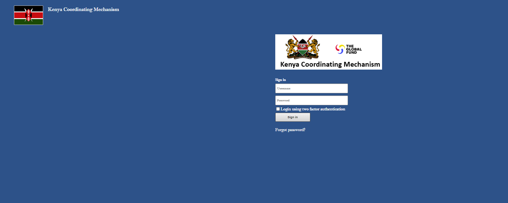

Access
###################

At any given time, you can either be:

* `New user`_ or
* `Existing user`_

New user
****************
To get a new user on board, please submit a request to *info@globalfundkcm.or.ke* with the subject 
"KCM Data System User Account" for account creation. Provide at least the first and last name
and email address.

Existing user
==============
#.	Open your web browser and navigate to this URL: https://kcmdashboard.org/
#. Enter your *username* and *password* in the login fields
#.	Click the Login button to access ODS. 

.. note:: If your username and password are correct, you will be successfully logged into KODS. Otherwise click on **Forgot Password** and follow the prompts.

The log in page should be similar to the image below.

Navigation
****************

After a successful login, you'll typically land on the KCM summary dashboard, unless you don’t have access to this application. 

The page should look like the image below.

   .. image:: images/kcmdashboard_start.png
     :width: 600

The main menu is usually located on the left or top of the dashboard. 

   .. image:: images/apps_menu.png
     :width: 600

It serves as the primary navigation tool for accessing various KODS modules and functionalities. 
Common menu items include:

#. **Data Entry:** Access data entry forms and data capture tools.
#. **Analytics:** Explore data analytics, charts, and reports.
#. **Data Administration:** Manage data elements, indicators, datasets, and other data-related settings.
#. **User Administration:** Control user accounts, roles, and permissions.
#. **Maintenance:** Perform system maintenance tasks, like backups and updates.
#. **Apps:** Access additional ODS applications or modules.
#. **Settings:** Configure system settings and preferences.

.. note:: Your access to these applicatations will be limited depending on your roles in the system.